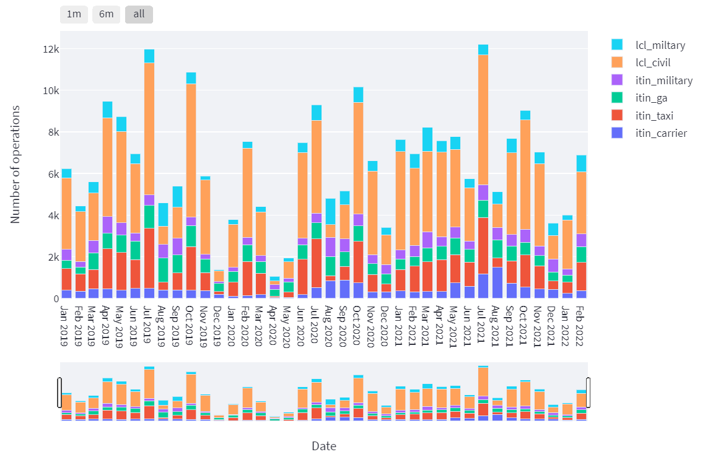

# Operations at PAE and MWH Airports 🛩️🌎

## About

A Python-based application utilizing Streamlit to provide structured, interactive visualizations on the operations (take-offs and landings) at PAE and MWH airports.

The Python implementation is available at <https://github.com/steffen-coe/Airport-Operations>. It is available under an [MIT License](LICENSE).

Data is taken from the FAA's Operations Network (OPSNET), available at <https://aspm.faa.gov/opsnet/sys/Airport.asp>.

## Usage

The application can be found under <https://share.streamlit.io/steffen-coe/airport-operations/main/app.py>.

The application was written in the Python programming language (version 3.8), using the [Streamlit interface](https://streamlit.io/) to produce an interactive user interface with tables and visuals.

## Pages (`src/*`)

The code for the individual pages in the Streamlit app is contained in the files the `src/` folder. Within each of these files, when the radio button in the app's sidebar is activated for the respective page, the `write()` function is called and executed, printing the page content in the app.

## Licensing

See the [LICENSE](LICENSE) file for licensing information as it pertains to files in this repository.

## Requirements

Please see the [requirements](requirements.txt) for Python requirements and dependencies.

## Contact

The author can be contacted via email for any questions or help regarding the use of this app.

+ Steffen Coenen (scoenen [at] uw.edu)

## Documentation

Further documentation can be found in the code. Each function contains its own documentation with description of all function parameters.
